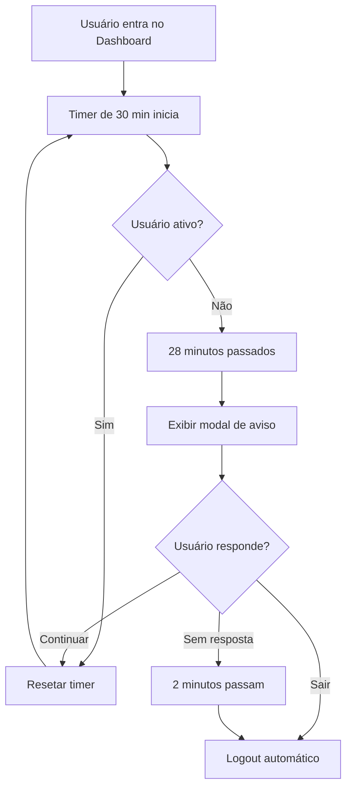

# Sistema de Timeout de Sessão por Inatividade

## Visão Geral

O Cosmos Astral implementa um sistema automático de encerramento de sessão por inatividade, que protege os dados do usuário ao detectar ausência de atividade por um período prolongado.

## Funcionalidades

### 🕐 Detecção de Inatividade
- **Tempo de inatividade:** 30 minutos (configurável)
- **Eventos monitorados:**
  - Movimentos do mouse
  - Cliques
  - Teclas pressionadas
  - Scroll
  - Touch (dispositivos móveis)

### ⚠️ Sistema de Aviso
- **Aviso prévio:** 2 minutos antes do timeout
- **Modal interativo** com countdown visual
- **Opções para o usuário:**
  - Continuar conectado (reseta o timer)
  - Sair agora (logout imediato)

### 🔒 Encerramento Automático
- Se o usuário não interagir, a sessão é encerrada automaticamente
- Logout seguro com limpeza de tokens
- Redirecionamento para tela de autenticação

## Arquitetura

### 1. Hook `useInactivityTimeout`
**Localização:** `src/hooks/useInactivityTimeout.ts`

```typescript
useInactivityTimeout({
  timeout: 30 * 60 * 1000,      // 30 minutos
  warningTime: 2 * 60 * 1000,   // Aviso 2 minutos antes
  onWarning: (remainingSeconds) => {
    // Exibir modal de aviso
  },
  onTimeout: () => {
    // Fazer logout
  },
  enabled: true
});
```

**Características:**
- Throttling automático (1 segundo) para evitar excesso de processamento
- Cleanup automático ao desmontar
- Configurável por componente

### 2. Componente `InactivityWarningModal`
**Localização:** `src/components/inactivity-warning-modal.tsx`

**Características:**
- Countdown visual em tempo real
- Design responsivo e acessível
- Animações suaves
- Informações claras sobre segurança

### 3. Integração no Dashboard
**Localização:** `src/components/cosmos-dashboard.tsx`

O hook é ativado automaticamente quando o usuário entra no dashboard e permanece ativo durante toda a sessão.

## Configuração

### Ajustar Tempo de Inatividade

Para alterar o tempo de inatividade, edite em `cosmos-dashboard.tsx`:

```typescript
useInactivityTimeout({
  timeout: 45 * 60 * 1000,    // 45 minutos em vez de 30
  warningTime: 5 * 60 * 1000, // Aviso 5 minutos antes
  // ...
});
```

### Desabilitar em Desenvolvimento

Para desabilitar durante desenvolvimento (não recomendado em produção):

```typescript
useInactivityTimeout({
  // ...
  enabled: false // ou: enabled: process.env.NODE_ENV === 'production'
});
```

### Personalizar Eventos Monitorados

Edite o array `events` em `useInactivityTimeout.ts`:

```typescript
const events = [
  'mousedown',
  'mousemove',
  'keypress',
  'scroll',
  'touchstart',
  'click',
  // Adicione mais eventos se necessário
];
```

## Fluxo de Funcionamento



## Segurança

### Proteção de Dados
- **Previne acesso não autorizado:** Se o usuário se afasta e esquece de fazer logout
- **Limpeza automática:** Tokens são removidos ao expirar
- **Sem dados residuais:** Informações sensíveis são limpas da memória

### Conformidade
- Boa prática recomendada pela OWASP
- Alinhado com LGPD (proteção de dados pessoais)
- Reduz riscos de sessão hijacking

## Experiência do Usuário

### Feedback Visual
- Modal elegante e não intrusivo
- Countdown claro e visível
- Opções bem destacadas

### Mensagens Claras
- **Título:** "Sessão Inativa"
- **Descrição:** Explica o motivo do aviso
- **Informação adicional:** Benefícios de segurança

### Acessibilidade
- Cores com bom contraste
- Tamanhos de fonte legíveis
- Botões com áreas de toque adequadas

## Testes Recomendados

### Teste Manual
1. **Teste de inatividade:**
   - Fazer login
   - Deixar a página aberta sem interagir
   - Verificar se o aviso aparece após 28 minutos
   - Verificar se o logout acontece após 30 minutos

2. **Teste de continuação:**
   - Esperar o aviso aparecer
   - Clicar em "Continuar Conectado"
   - Verificar se o timer reseta

3. **Teste de atividade:**
   - Mover o mouse ou digitar regularmente
   - Verificar que o aviso nunca aparece

### Teste Automatizado (Recomendado)

```typescript
// Exemplo com Vitest + React Testing Library
describe('Inactivity Timeout', () => {
  it('should show warning after inactivity period', async () => {
    vi.useFakeTimers();
    render(<CosmosDashboard {...props} />);
    
    // Avançar tempo para 28 minutos
    vi.advanceTimersByTime(28 * 60 * 1000);
    
    expect(screen.getByText('Sessão Inativa')).toBeInTheDocument();
  });
  
  it('should logout after total timeout', async () => {
    vi.useFakeTimers();
    const mockLogout = vi.fn();
    render(<CosmosDashboard {...props} onLogout={mockLogout} />);
    
    // Avançar tempo para 30 minutos
    vi.advanceTimersByTime(30 * 60 * 1000);
    
    expect(mockLogout).toHaveBeenCalled();
  });
});
```

## Troubleshooting

### Modal não aparece
- Verificar se o hook está montado corretamente
- Verificar `enabled: true`
- Checar console para erros JavaScript

### Logout muito cedo
- Verificar configuração de `timeout`
- Verificar se há conflitos com outros timers
- Checar se eventos estão sendo capturados

### Timer não reseta
- Verificar throttling (pode ter delay de 1s)
- Verificar se eventos estão na lista de eventos monitorados
- Checar se há propagação de eventos bloqueada

## Melhorias Futuras

- [ ] Salvar rascunhos antes do logout
- [ ] Notificação sonora no aviso
- [ ] Opção de "Lembrar-me" para estender timeout
- [ ] Dashboard de administração para ajustar tempos
- [ ] Logs de sessões expiradas (analytics)
- [ ] Sincronização entre abas (SharedWorker ou BroadcastChannel)

## Referências

- [OWASP Session Management Cheat Sheet](https://cheatsheetseries.owasp.org/cheatsheets/Session_Management_Cheat_Sheet.html)
- [MDN: Web Security](https://developer.mozilla.org/en-US/docs/Web/Security)
- [React Hooks Best Practices](https://react.dev/reference/react/hooks)

